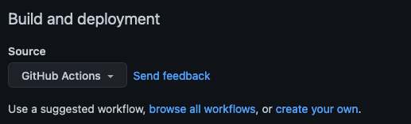
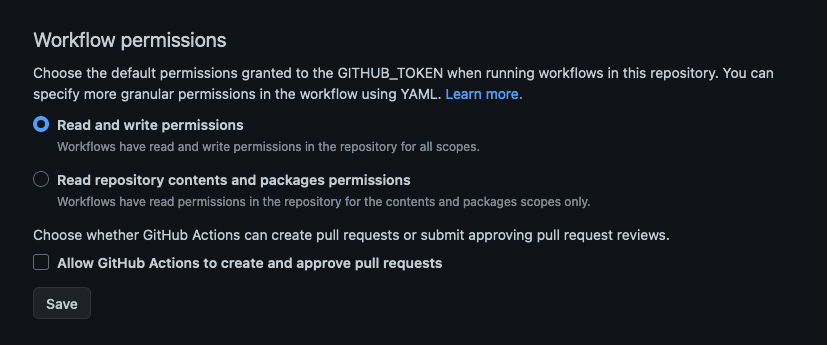

# StaticPub

An attempt to make a static ActivityPub instance.

```
TL;DR: 
ActivityPub is a protocol over HTTP that returns ActivityStreams 2.0 documents, 
this /hack/ generates these JSON+LD files from static Markdown files (plus a config file).
```
## Usage

To setup the instance, one needs to edit the [instance.cfg](instance.cfg) file (it's pretty well documented).
Once that's done, just run on a shell: 
```
python staticpub.py
```

This will use by default `instance.cfg` as the config file and generate the directories for our _single user instance_ content.

### Can I have more than one user?

Technically, yes, practically, no: At least, not using Github; you can only define just one CNAME record, pointing to a single directory. In case you have a VPS (or similar) and can setup multiple domains pointing to multiple directories in the webserver config, it could work.  
Anyway, in this case, you'll need to create an extra config file (which can be done by copying over the `instance.cfg` as `something.cfg`) and edit its settings.  
Then simply run on a shell:
```
python staticpub.py something.cfg
```
And as a result, you'll end up with a similar file structure but each user will have their "endpoints" contained in their directory (See `Paths.usersEndpoint` section in the config file).

## How does it works?

There are thousand of blog posts and documentation scattered all over the Internet talking about AP, but what does a _single user_ instance needs to be up and running? Not much apparently.  

### Github Actions

For this to work using Github Actions, you'll need to setup a new workflow that:

* Looks in a given branch for changes on: `staticpub.py` and "entries directory"
  * hint: the code was updated or a new entry was added
* Run these steps:
  * checkout the code
  * setup Python (3.10)
  * run StaticPub
  * commit modified files
  * push changes

You can always take a look to the [actual workflow](.github/workflows/staticpub.yml) to see the real thing.

Two things to keep in mind: 

1. In `Settings > Pages > Build and deployment`, you'll have to choose `Deploy from a branch`, select the branch you like (ie: `main`) and the `/docs` directory.



2. In `Settings > Actions > General > Workflow permissions`, you'll need to select `Read and write permissions` to allow pushing to the repo.



### Endpoints

The [Actor objects](https://www.w3.org/TR/activitypub/#actor-objects) section, establishes that `Actor` objects _must_ have the following properties:

* `inbox`, incoming Activities 
* `outbox`, outgoing Activities
* `following`, Actors we're following
* `followers`, Actors that follows us
* `preferredUsername`, our *handle*
* *plus a couple of other properties*

Additionally, the [Mastodon blog](https://blog.joinmastodon.org/2018/06/how-to-implement-a-basic-activitypub-server/) has documentation on [Webfinger](https://www.rfc-editor.org/rfc/rfc7033). This is a protocol that can be used to discover users on the internet. So besides `inbox`, `outbox`, etc, we're going to need a `.well-known/webfinger` endpoint.

So, basically, what we really need are barely 6 or 7 endpoints:

* `users/{preferredUsername}`
* `outbox/`
* `following/`
* `followers/`
* `posts/{noteId}`
* `.well-known/webfinger`
  * Note that this endpoint requires a query param, but we'll ignore it.
* And optionally: `featured/`

### How to format "Entries"

In this context, "Entries" are Markdown files with a pretty simple header that should contain at least `type` and `published` properties.

```
---
type: Note
published: 2023-01-30T21:08:00Z
---
This is an example for the StaticPub README file! 
```

which will converted to something like:

```
{
    "@context": "...",
    "type": "Note",
    "id": "https://...",
    "content": "This is an example for the StaticPub README file!",
    "published": "2023-01-30T21:08:00Z"
}
```

### `instance.cfg`

The [instance.cfg](instance.cfg) is nothing more than a simple [INI File](https://en.wikipedia.org/wiki/INI_file). It's well documented so anything you might want to know, it's already there.

### `staticpub.py`

It receives an optional parameter that references an `instance.cfg`, and will take its configurations from the `instance.cfg` file to build everything. In case you want to have a _multi user_ instance you need to have _multiple config files_, that's all.

## Things missing

### Inbox

This endpoint requires a _bit of trickery_ but since it's a _static_ instance, we can't implement:  
That is, when an instance receives a `POST` to this endpoint, it needs to verify the remote user Public Key to verify it's authenticity (using `HTTP Signatures`), but again, since it's _static_ we can't process `POST` and much less verify OpenSSL keys.

### Following

The case is similar to `/inbox`. We can't simply process _federated_ requests.

### Delivery

Since we can't have followers (i mean, it's a hardcoded _empty_ endpoint), we can't send anything to anyone. But, let's say, we do have them: We would need to setup a (GH Action) Workflow that walks through the followers and `POST`s to their instances our activities. Also, we'd need to provide our Public Key, for verification.  
So, in theory, this could be done, probably.

## Can I use other CI than Github Actions?

Yes, totally. This can run on anything that can run `Python 3.10+` (mostly because `Union` type hints are written as `X | Y` instead of `Union[X, Y]`).

## References

There's a great blog post by Justin Garrison:
* [https://www.justingarrison.com/blog/2022-12-06-mastodon-files-instance/](https://www.justingarrison.com/blog/2022-12-06-mastodon-files-instance/)
* [https://github.com/rothgar/static-mastodon](https://github.com/rothgar/static-mastodon)
  
Also, there's a somewhat detailed blog post in the Mastodon blog:
* [https://blog.joinmastodon.org/2018/06/how-to-implement-a-basic-activitypub-server/](https://blog.joinmastodon.org/2018/06/how-to-implement-a-basic-activitypub-server/)

The [W3C ActivityPub Recommendation](https://www.w3.org/TR/activitypub/) has a very detailed document with all the info you might need for a more robust implementation. 

## LICENSE

See [LICENSE](LICENSE)